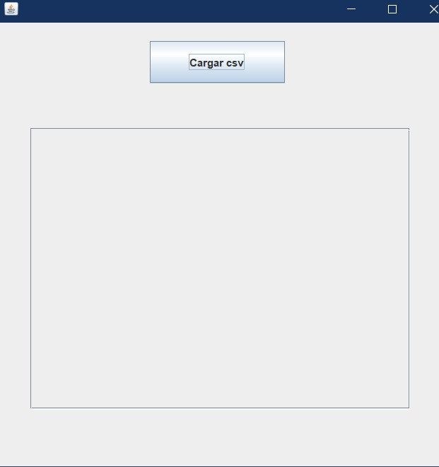
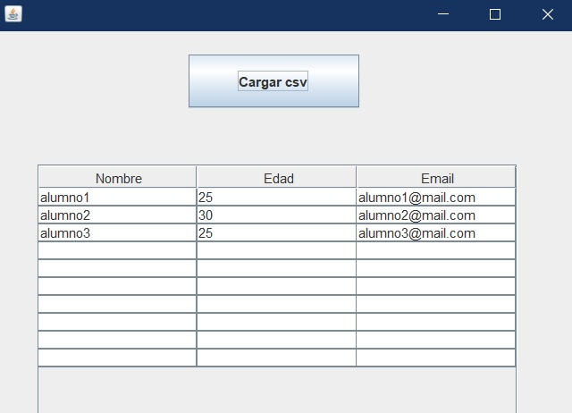

# Ejemplo para leer CSV en java

Es importante que tomen en cuenta que para el proeycto 2 deben implementar el patron Modelo Vista Controlador (MVC), de este modo, el ejemplo de esta carpeta contiene la forma de leer archivos CSV por medio de interfaz grafica, logrando hacer uso de MVC

El ejemplo consiste en una interfaz con un botón para abrir un explorador de archivos y seleccionar el .csv que desean cargar. El CSV del ejemplo tiene el siguiente formato:

| Nombre | Edad | Email          |
|--------|------|----------------|
| alumno1   | 25   | alumno1@gmail.com  |
| alumno2    | 30   | alumno2@gmail.com   |
| alumno3   | 28   | alumno3@gmail.com  |

La presentación con los conceptos de MVC se encuentra en esta misma carpeta.  
[Presentacion](Clase_MVC.pdf)